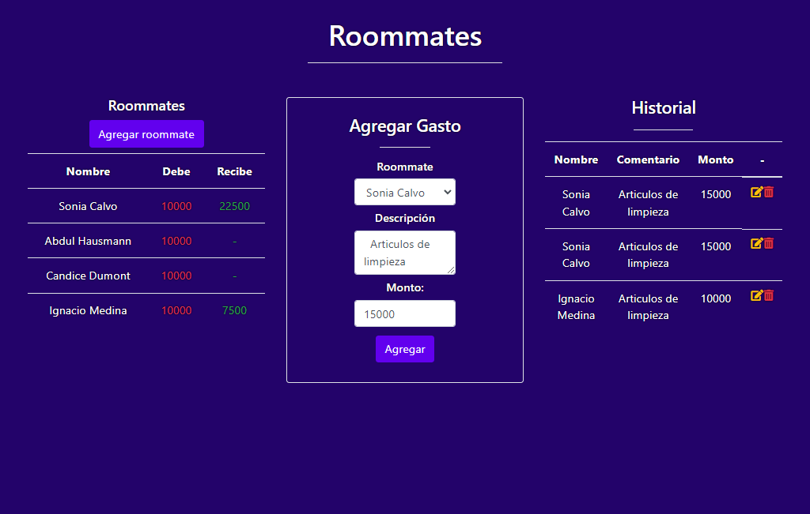

 <h1 align= left ><b>Sprint 6 Equipo Verde</b> </h1>

<br>

<h2><b>Descripción del Proyecto</b> </h2>

📝 Es bien sabido que entre las mejores recomendaciones que un programador amateur puede recibir para mejorar sus
habilidades es “crear aplicaciones”, sin darle tanta importancia a la temática a elaborar, sino que solo basta con un
problema para desarrollar una solución digital.
En esta prueba deberás crear un servidor con Node que sirva una interfaz HTML que tendrás a disposición en el
apoyo y cuya temática está basada en el registro de gastos entre co-habitantes.
Además, deberás servir una API REST que permita hacer lo siguiente:
● Almacenar co-habitantes nuevos usando random user.
● Devolver todos los co-habitantes almacenados.
● Registrar nuevos gastos.
● Devolver el historial de gastos registrados.
● Modificar la información correspondiente a un gasto.
● Eliminar gastos del historial.
A continuación se muestra una imagen con la interfaz que deberás devolver en la ruta raíz del servidor.



Rutas que debes crear en tu servidor:
● /GET: Debe devolver el documento HTML diponibilizado en el apoyo.
● /roommate POST: Almacena un nuevo roommate ocupando random user.
● /roommate GET: Devuelve todos los roommates almacenados.
● /gastos GET: Devuelve el historial con todos los gastos registrados.
● /gasto PUT: Edita los datos de un gasto.
● /gasto DELETE: Elimina un gasto del historial.

Requerimientos:
1. Ocupar el módulo File System para la manipulación de archivos alojados en el servidor. (3pts)
2. Capturar los errores para condicionar el código a través del manejo de excepciones. (1pt)
3. El botón “Agregar Roommate” de la aplicación cliente genera una petición POST (sin payload) esperando que
el servidor registre un nuevo roommate random con la API randomuser, por lo que debes preparar una ruta
POST /roommate en el servidor que ejecute una función asíncrona importada de un archivo externo al del
servidor (la función debe ser un módulo), para obtener la data de un nuevo usuario y la acumule en un JSON
(roommates.json).
El objeto correspondiente al usuario que se almacenará debe tener un id generado con el paquete UUID.
(2pts)
4. Crear una API REST que contenga las siguientes rutas:
a. GET /gastos: Devuelve todos los gastos almacenados en el archivo gastos.json.
b. POST /gasto: Recibe el payload con los datos del gasto y los almacena en un archivo JSON
(gastos.json).
c. PUT /gasto: Recibe el payload de la consulta y modifica los datos almacenados en el servidor
(gastos.json).
d. DELETE /gasto: Recibe el id del gasto usando las Query Strings y la elimine del historial de gastos
(gastos.json).
e. GET /roommates: Devuelve todos los roommates almacenados en el servidor (roommates.json)
Se debe considerar recalcular y actualizar las cuentas de los roommates luego de este proceso. (3pts)
5. Devolver los códigos de estado HTTP correspondiente a cada situación. (1pt)

<br>

<h2><b>Instrucciones de Instalación</b> </h2> 

⚙️ Para instalar las dependencias necesarias, sigue los siguientes pasos:

1. Clona el repositorio en tu máquina local.
2. Abre una terminal y navega hasta la carpeta del proyecto.
3. Ejecuta el siguiente comando para instalar las dependencias:

   npm install

4. Abrir el archivo html ingresando al https://localhost:3000
5. Llenar el formulario y enviar


<details>  <summary><b>Ver las instrucciones</b></summary> 


1. Instalar las dependencias:

   ```sh
   npm install
   ```

2. En el caso de no poder instalar las dependencias:

   ```sh
   npm install --force
   ```

3. Las librerias que estamos ocupando `package.json`:

    ````sh
    ... 
    "name": "helpers",
    "version": "1.0.0",
    "description": "",
    "main": "index.js",
    + "type": "module",
    "scripts": {
    "test": "echo \"Error: no test specified\" && exit 1"
    },
    "author": "",
    "license": "ISC",
    "dependencies": {
    "body-parse": "^0.1.0",
    "express": "^4.18.2",
    "hbs": "^4.2.0",
    "node-fetch": "^3.3.2",
    "nodemailer": "^6.9.4",
    "path": "^0.12.7",
    "uuid": "^9.0.0"
    }
    ````

 
</details>

## Funcionalidades :sparkles:

✨ Con nuestra aplicacion puedes:

1. Funcionalidad : Agregar personas(roommates) de forma aleatoria
2. Funcionalidad : Agregar Gastos y Descripcion de los mismos y guardarlos en un archivo .json
3. Funcionalidad : Calcular los que deben y lo que reciben cada uno de los roommates 


## Participantes del Grupo :busts_in_silhouette:

1. Cecilia Montero : https://github.com/cmonlop

2. Karla Mieres : https://github.com/karlamieres

3. Zimram Blanco : https://github.com/Zimram

4. Andrea Pilquiman : https://github.com/AndreaPLL

5. Gonzalo Aranda : https://github.com/gonzaloaranda

6. Felipe Andres Parra : https://github.com/33fparra

### Este proyecto está bajo la licencia MIT. Para más información, consulta el archivo LICENSE.


